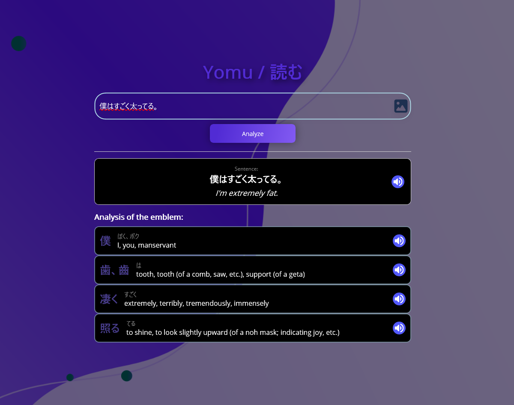

# Yomu (読む) - Japanese Sentence Analyzer

**Yomu** is a Japanese language tool, built with **.NET MAUI**. It is a simple and minimalistic dictionary providing morphological analysis of Japanese text. Breaking down sentences into their base components, and providing context from multiple linguistic databases. This application is fully offline. All dictionary and kanji data are included in the repository as SQLite databases.

## 🚀 Key Features

- **Morphological Analysis:** Powered by **NMeCab**, the app "tokenizes" Japanese sentences, identifying word boundaries, parts of speech, and dictionary forms (lemmatization).
- **Comprehensive Kanji Data:** Detailed information for over 13,000 Kanji (meanings, readings) via **KANJIDIC2**.
- **Integrated Dictionary:** Instant lookups for words using the **JMdict** database.
- **Contextual Examples:** Displays example sentences from the **Tatoeba Project** to show how words are used in real-life scenarios. Provides contextual translations by retrieving the best matching sentences from the database.
- **OCR Integration:** Extract Japanese text from images using **Tesseract OCR**, supporting both horizontal and vertical layouts.
- **Offline-First:** All linguistic data is stored in optimized **SQLite** databases locally on the device. No internet connection required for analysis.

## 🛠️ Technical Stack

- **Framework:** .NET MAUI (Multi-platform App UI)
- **Pattern:** MVVM (Model-View-ViewModel) using **CommunityToolkit.Mvvm**
- **Database:** SQLite with multiple attached databases (KanjiDIC, JMDict, Tatoeba)
- **OCR Engine:** Tesseract OCR (Offline)
- **Linguistic Engine:** NMeCab (Japanese Morphological Analyzer)
- **UI:** XAML with custom DataTemplates and CollectionViews

## 📸 Screenshots

| Search & Analysis | Home |
| :---: | :---: |
|  |  |

## How it works
The app follows a structured pipeline to transform raw input into linguistic insights:
- **1. Input Methods:** 
   - **Manual Text Entry:** Users can type or paste Japanese text directly into the analyzer.
   - **Optical Character Recognition (OCR):** Using Tesseract OCR, the app can extract Japanese text from uploaded images
- **2.** **Tokenization:** NMeCab breaks the sentence into tokens.
- **3.** **Lookup:** The app performs a joint SQL query across JMdict, KanjiDIC, and Tatoeba.
- **4.** **Display:** Results are presented in a structured MVVM-bound UI.
- **5.** **Copy:** Click on a result to copy it to the clipboard.
> **_NOTE:_**  Translation only works from Japanese to English

## 📥 Installation & Setup

1. **Clone the repository:**
   ```bash
   git clone https://github.com/Zero89-sys/Yomu-Japanese-Translator.git
   cd Yomu-Japanese-Translator

## 🙏 Acknowledgments
This project uses linguistic data provided by:
- **Tesseract OCR** – Optical Character Recognition engine for extracting Japanese text from images.
- **Electronic Dictionary Research and Development Group** (JMdict, KANJIDIC2)
- **Tatoeba Project** (Example sentences)
- **NMeCab** (Morphological analysis engine)

## 📄 License
Distributed under the MIT License. See `LICENSE` for more information.
